# 21CN验证码自动识别项目
 ---
 ## 步骤:
 1. Windows平台下, 修改Caffe源码满足多任务需求, 并编译Caffe(Release x64 GPU版本为例)
 2. 通过爬取的验证码生成训练用数据库
 3. 通过数据集生成多标签文本文件(py脚本实现)
 4. 设计多任务深度网络(通过AlexNet模型进行修改)
 5. 训练网络
 6. 测试网络, 并将测试用源码改成DLL并导出识别函数供其他程序使用
 ---


### 一. 编译Caffe
本例采用多任务分类的方式识别验证码, 因此编译前需要对Caffe源代码进行修改,
需要修改的源码如下所示:

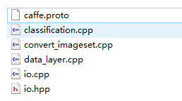

#### caffe.proto:
line_30 增加一个可重复类型, 支持多标签

```
message Datum {
  optional int32 channels = 1;
  optional int32 height = 2;
  optional int32 width = 3;
  // the actual image data, in bytes
  optional bytes data = 4;
  optional int32 label = 5;
  // Optionally, the datum could also hold float data.
  repeated float float_data = 6;
  // If true data contains an encoded image that need to be decoded
  optional bool encoded = 7 [default = false];

  //新增可重复类型 支持多标签
  repeated float labels = 8;
}
```

#### convert_imageset.cpp:
line_74 将int类型改为浮点类型的容器类型, 以支持多标签需求
```
/*   std::ifstream infile(argv[2]);
  std::vector<std::pair<std::string, int> > lines;
  std::string line;
  size_t pos;
  int label;
  while (std::getline(infile, line)) {
    pos = line.find_last_of(' ');
    label = atoi(line.substr(pos + 1).c_str());
    lines.push_back(std::make_pair(line.substr(0, pos), label));
  } */
  std::ifstream infile(argv[2]);
  std::vector<std::pair<std::string, vector<float>> > lines;
  std::string filename;
  vector<float> labels(4);
  while(infile >> filename >> labels[0] >> labels[1] >> labels[2] >> labels[3]){
	  lines.push_back(std::make_pair(filename, labels));
  }
```

#### io.hpp
line_114 增加两个重载函数的声明
```
inline bool ReadFileToDatum(const string& filename, Datum* datum) {
  return ReadFileToDatum(filename, -1, datum);
}

bool ReadImageToDatum(const string& filename, const int label,
    const int height, const int width, const bool is_color,
    const std::string & encoding, Datum* datum);

	//--------------------------增加的重载函数---------------------------
bool ReadImageToDatum(const string& filename, std::vector<float> labels,
	const int height,  const int width, const bool is_color,
    const std::string & encoding, Datum* datum);

bool ReadFileLabelsToDatum(const string& filename, std::vector<float> labels, Datum* datum);
	//--------------------------------------------------------------------
```

#### io.cpp
line_128 参照ReadImageToDatum, 增加以下重载函数的实现
```
bool ReadImageToDatum(const string& filename, std::vector<float> labels,
    const int height, const int width, const bool is_color,
    const std::string & encoding, Datum* datum)
{
	//打印多标签
	std::cout << filename << " " << labels[0] << " " << labels[1] <<  " " << labels[2] << " " << labels[3] << std::endl;
	cv::Mat cv_img = ReadImageToCVMat(filename, height, width, is_color);
	if (cv_img.data) {
    if (encoding.size()) {
      if ( (cv_img.channels() == 3) == is_color && !height && !width &&
          matchExt(filename, encoding) )
        //return ReadFileToDatum(filename, label, datum);
		return ReadFileLabelsToDatum(filename, labels, datum);
      std::vector<uchar> buf;
      cv::imencode("."+encoding, cv_img, buf);
      datum->set_data(std::string(reinterpret_cast<char*>(&buf[0]),
                      buf.size()));
      //datum->set_label(label);

	  datum->clear_labels();
	  datum->add_labels(labels[0]);
	  datum->add_labels(labels[1]);
	  datum->add_labels(labels[2]);
	  datum->add_labels(labels[3]);

      datum->set_encoded(true);
      return true;
    }
    CVMatToDatum(cv_img, datum);
    //datum->set_label(label);
	datum->clear_labels();
	datum->add_labels(labels[0]);
	datum->add_labels(labels[1]);
	datum->add_labels(labels[2]);
	datum->add_labels(labels[3]);
    return true;
  } else {
    return false;
  }
}
```

参照ReadFileToDatum函数进行修改
```
bool ReadFileToDatum(const string& filename, const int label,
    Datum* datum) {
  std::streampos size;

  fstream file(filename.c_str(), ios::in|ios::binary|ios::ate);
  if (file.is_open()) {
    size = file.tellg();
    std::string buffer(size, ' ');
    file.seekg(0, ios::beg);
    file.read(&buffer[0], size);
    file.close();
    datum->set_data(buffer);
    datum->set_label(label);
    datum->set_encoded(true);
    return true;
  } else {
    return false;
  }
}

//add
bool ReadFileLabelsToDatum(const string& filename, std::vector<float> labels,
    Datum* datum) {
  std::streampos size;

  fstream file(filename.c_str(), ios::in|ios::binary|ios::ate);
  if (file.is_open()) {
    size = file.tellg();
    std::string buffer(size, ' ');
    file.seekg(0, ios::beg);
    file.read(&buffer[0], size);
    file.close();
    datum->set_data(buffer);
    //datum->set_label(label);

	datum->clear_labels();
	datum->add_labels(labels[0]);
	datum->add_labels(labels[1]);
	datum->add_labels(labels[2]);
	datum->add_labels(labels[3]);

    datum->set_encoded(true);
    return true;
  } else {
    return false;
  }
}
```

#### data_layer.cpp
line_45 完成以下两处修改
```
LOG_IF(INFO, Caffe::root_solver())
      << "output data size: " << top[0]->num() << ","
      << top[0]->channels() << "," << top[0]->height() << ","
      << top[0]->width();
  // label
  /* if (this->output_labels_) {
    vector<int> label_shape(1, batch_size);
    top[1]->Reshape(label_shape);
    for (int i = 0; i < this->prefetch_.size(); ++i) {
      this->prefetch_[i]->label_.Reshape(label_shape);
    }
  } */
  if(this->output_labels_)
  {
	  top[1]->Reshape(batch_size, 4, 1, 1);
	  for(int i = 0; i < this->prefetch_.size(); ++i)
	  {
		  this->prefetch_[i]->label_.Reshape(batch_size, 4, 1, 1);
	  }
  }
}
```
```
// Apply data transformations (mirror, scale, crop...)
    timer.Start();
    int offset = batch->data_.offset(item_id);
    Dtype* top_data = batch->data_.mutable_cpu_data();
    this->transformed_data_.set_cpu_data(top_data + offset);
    this->data_transformer_->Transform(datum, &(this->transformed_data_));
    // Copy label.
	/*if (this->output_labels_) {
	  Dtype* top_label = batch->label_.mutable_cpu_data();
	  top_label[item_id] = datum.label();
	} */
	if(this->output_labels_)
	{
		for(int i = 0; i < 4; i++)
		{
			Dtype* top_label = batch->label_.mutable_cpu_data();
			top_label[item_id * 4 + i] = datum.labels(i);
		}
	}
```
#### classification.cpp
为满足多标签需求, 这里需要对测试程序的main函数进行稍加修改:
```
int main(int argc, char** argv) {
  if (argc != 6) {
    std::cerr << "Usage: " << argv[0]
              << " deploy.prototxt network.caffemodel"
              << " mean.binaryproto labels.txt img.jpg" << std::endl;
    return 1;
  }

  ::google::InitGoogleLogging(argv[0]);

  string model_file   = argv[1];	//模型描述文件deploy.prototxt
  string trained_file = argv[2];	//训练好的网络模型network.caffemodel
  string mean_file    = argv[3];	//均值文件mean.binaryproto
  string label_file   = argv[4];	//标签文件labels.txt---类别号与类别名对应表
  Classifier classifier(model_file, trained_file, mean_file, label_file);	//构造Classifier类对象，构造函数输入参数包括上面四个

  string file = argv[5];	//待分类测试的图像img.jpg

  std::cout << "---------- Prediction for "
            << file << " ----------" << std::endl;

  cv::Mat img = cv::imread(file, -1);
  CHECK(!img.empty()) << "Unable to decode image " << file;
  /*
  std::vector<Prediction> predictions = classifier.Classify(img);	//调用Classifier类对象的分类函数Classify，传入参数为cv::Mat图像数据，返回

  /* Print the top N predictions. */
  /*
  for (size_t i = 0; i < predictions.size(); ++i) {
    Prediction p = predictions[i];
    std::cout << std::fixed << std::setprecision(4) << p.second << " - \""
              << p.first << "\"" << std::endl;
  }
  */

  ////////////////////////////新增，以支持多任务分类
  //clock_t time_start, time_end;
  //time_start = clock();
  int TASK_NUM = 4;	//多任务数
  int TOP_N = 1;	//top N
  for (int index = 0; index < TASK_NUM; index++)
  {
	  std::vector<Prediction> predictions = classifier.Classify(img, TOP_N, index);	//进行多任务分类，并传入任务索引(索引为index=0时进行前向传播，返回任务0的预测结果；索引为index！=0时，不需要在做前向传播，直接返回任务index的预测结果)
	  for (size_t i = 0; i < predictions.size(); ++i) {	//打印预测的top N
		  Prediction p = predictions[i];
		  std::cout << std::fixed << std::setprecision(4) << p.second << " - \""
			  << p.first << "\"" << std::endl;
	  }
  }
  //time_end = clock();
  //double duration = (double)(time_end - time_start) / CLOCKS_PER_SEC;
  //std::cout << "duaration:" << duration << std::endl;
}
```
---
完成所有修改后, 即可修改配置文件进行编译了

因为本例使用的是GPU版本, 请提前下载安装好CUDA8.0.44, 并且下载好cudnn-7.5 v5.0
将解压好的文件复制到CUDA8.0的目录下
```
C:\Program Files\NVIDIA GPU Computing Toolkit\CUDA\v8.0
```

使用notepad++打开caffe\scripts\build_win.cmd
直接翻到else处, 参照如下设置:(如果使用CPU, 请将CPU_ONLY设置为1)

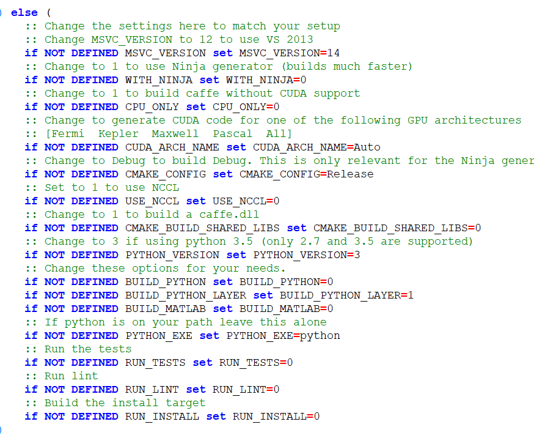

完成修改后, 即可在caffe根目录下打开cmd或ps, 敲入命令执行编译脚本:
```
.\scripts\build_win.cmd
```

编译完成后, 根目录将出现build文件夹

### 二. 生成训练用数据库

1. 爬取21cn的验证码图片, 本例爬取了30000张左右,

  放到caffe\data\captcha\captha_train目录下

  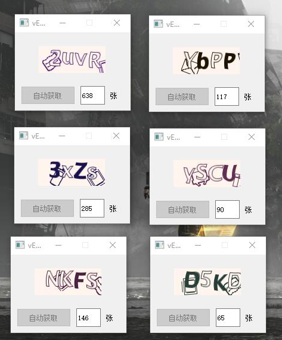

2. 再爬取5000张, 作为测试集,

  放到caffe\data\captcha\captha_val目录下

### 三. 生成多标签文本文件

  这里我使用了简单的python脚本实现

  #### walk.py
  ```
  import os
  import sys

  f = open(sys.argv[2], 'w')

  #生成标签文件脚本
  list = os.listdir(sys.argv[1])
  for i in range(0,len(list)):
  		path = os.path.join(sys.argv[1],list[i])
  		if os.path.isfile(path) and (os.path.splitext(path)[-1] == '.jpg' \
  								or os.path.splitext(path)[-1] == '.png' \
  								or os.path.splitext(path)[-1] == '.bmp'):
  			file_name = os.path.basename(path)
  			index = file_name.find('_', 0, len(file_name))
  			a = ord(file_name[index + 1])
  			if(a >=97 and a <= 122):
  				a = a - 87
  			else:
  				a = a - 48
  			b = ord(file_name[index + 2])
  			if(b >=97 and b <= 122):
  				b = b - 87
  			else:
  				b = b - 48
  			c = ord(file_name[index + 3])
  			if(c >=97 and c <= 122):
  				c = c - 87
  			else:
  				c = c - 48
  			d = ord(file_name[index + 4])
  			if(d >=97 and d <= 122):
  				d = d - 87
  			else:
  				d = d - 48
  			print(os.path.basename(path) + ' %d %d %d %d ' % (a, b, c, d), file=f)

  f.close();
  ```

  将walk.py放入caffe\data目录下, 执行以下命令:
  ```
  python .\walk.py .\captcha_train .\captcha_train.txt
  python .\walk.py .\captcha_val .\captcha_val.txt
  ```
  参数一为图片集所在的目录, 参数二为要生成的多标签文本, 生成的文本类似如下:

  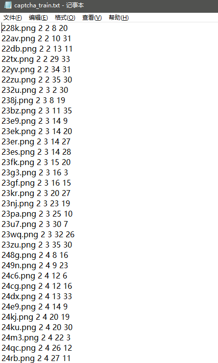

  即图片文件名和其对应的验证码答案(其中0-9代表数字0-9, 10-35代表字母a-z)

  将图片集转为效率更高的lmdb格式

  使用刚刚编译Caffe得到的convert_imageset.exe即可将对应的图片集转换为lmdb格式

  再Caffe根目录下新建create_captcha_lmdb.bat 复制以下命令
  ```
  .\build\tools\Release\convert_imageset.exe --resize_height=227 --resize_width=227 --backend="lmdb" --shuffle .\data\captcha\captcha_train\ .\data\captcha\captcha_train.txt .\data\captcha\captcha_train_lmdb
echo.
.\build\tools\Release\convert_imageset.exe --resize_height=227 --resize_width=227 --backend="lmdb" --shuffle .\data\captcha\captcha_val\ .\data\captcha\captcha_val.txt .\data\captcha\captcha_val_lmdb
echo.
pause
  ```
  --resize表示调整大小 --shuffle表示随机打乱顺序
  双击运行后, caffe\data\captcha内的文件如下:
  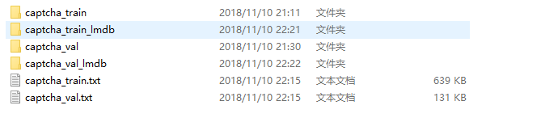


### 四. 准备训练网络
  这里使用通过AlexNet修改后的网络来实现训练:

  在caffe\models下新建文件家captcha, 复制准备好的训练网络模型
  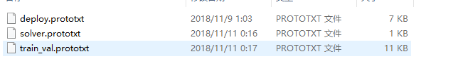

  train_val.prototxt的结构如下:
  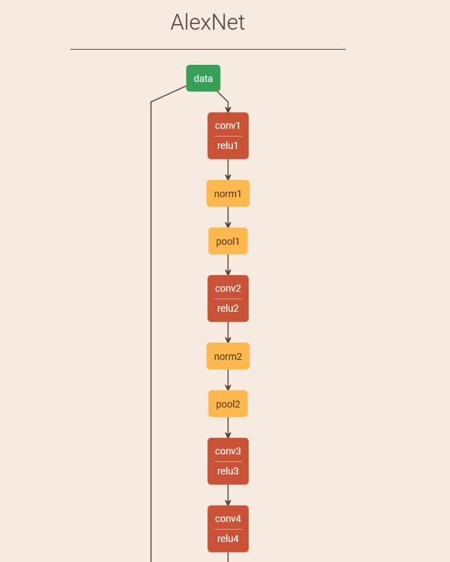
  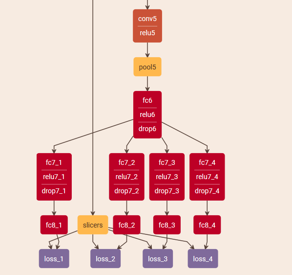

### 五. 训练
  caffe根目录下创建train.bat 命令如下:
  ```
  .\build\tools\Release\caffe.exe train -solver .\models\captcha\solver.prototxt -gpu=0
echo.
pause
  ```

  接下来静等训练完成, 训练完成准确率达到99%

  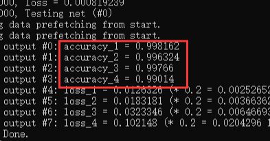

  训练完成后, 将在models目录下生成训练成功的模型文件captcha_iter_15000.caffemodel


### 六. 测试和封装

Caffe下的example\cpp_classification\classification.cpp即是测试程序classification.exe的源码

该程序编译后的路径为Caffe\build\examples\cpp_classification\Release\classification.exe

首先找一张验证码图片1.png放到Caffe根目录下:

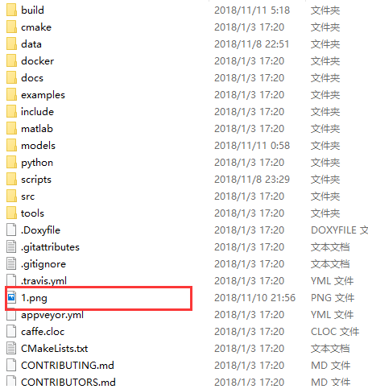

然后将Caffe/models/captcha_iter_15000.caffemodel复制到Caffe\models\catpcha目录下, 并把均值文件
imagenet_mean.binaryproto复制到Caffe\examples\cpp_classification目录下

在Caffe\examples\cpp_classification目录创建文本文件labels.txt, 内容如下:
```
4
36 36 36 36
0 0
1 1
2 2
2 3
4 4
5 5
6 6
7 7
8 8
9 9
10 a
11 b
12 c
13 d
14 e
15 f
16 g
17 h
18 i
19 j
20 k
21 l
22 m
23 n
24 o
25 p
26 q
27 r
28 s
29 t
30 u
31 v
32 w
33 x
34 y
35 z
0 0
1 1
2 2
2 3
4 4
5 5
6 6
7 7
8 8
9 9
10 a
11 b
12 c
13 d
14 e
15 f
16 g
17 h
18 i
19 j
20 k
21 l
22 m
23 n
24 o
25 p
26 q
27 r
28 s
29 t
30 u
31 v
32 w
33 x
34 y
35 z
0 0
1 1
2 2
2 3
4 4
5 5
6 6
7 7
8 8
9 9
10 a
11 b
12 c
13 d
14 e
15 f
16 g
17 h
18 i
19 j
20 k
21 l
22 m
23 n
24 o
25 p
26 q
27 r
28 s
29 t
30 u
31 v
32 w
33 x
34 y
35 z
0 0
1 1
2 2
2 3
4 4
5 5
6 6
7 7
8 8
9 9
10 a
11 b
12 c
13 d
14 e
15 f
16 g
17 h
18 i
19 j
20 k
21 l
22 m
23 n
24 o
25 p
26 q
27 r
28 s
29 t
30 u
31 v
32 w
33 x
34 y
35 z
```

在根目录创建test.bat 内容如下:
```
.\build\examples\cpp_classification\Release\classification.exe .\models\captcha\deploy.prototxt .\models\captcha\captcha_iter_15000.caffemodel .\examples\cpp_classification\imagenet_mean.binaryproto .\examples\cpp_classification\labels.txt .\1.png
pause
```

文件准备完毕后, 即可双击test.bat查看结果

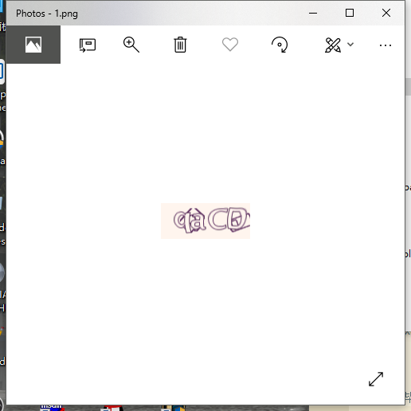
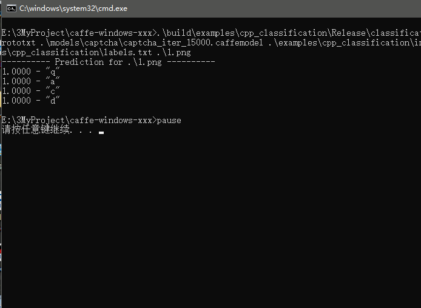

至此, Caffe的编译和测试已经全部完成, 接写来就是将该测试程序封装为dll并提供导出函数供其他程序使用

1. 新建vs2015 Release x64空工程, 添加一个cpp文件, 并将classification.cpp内容全部复制到该cpp中
2. 打开Caffe目录下的build\Caffe.sln, 在解决方案中找到example\classification

  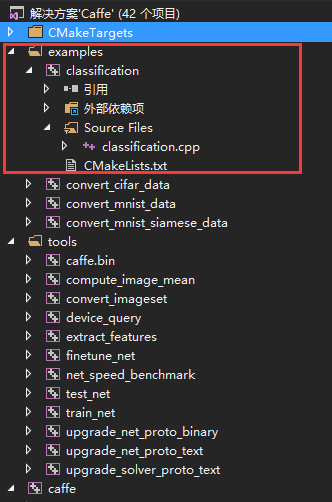
3. 右键classification, 打开属性窗口, 将以下选项全部复制到自己的工程中:
  - 配置属性--C/C++--附加包含目录
  - 配置属性--C/C++--预处理器--预处理器定义
  - 配置属性--链接器--输入--附加依赖项
  - 配置属性--链接器--输入--忽略特定默认库添加:

    %(IgnoreSpecificDefaultLibraries)
4. 复制Caffe\build\examples\cpp_classification\Release下所有dll到你自己的工程目录下
5. 在工程源码路径创建文件夹DataFile, 将以下文件添加进去:

  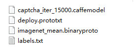

  分别为: 训练好的模型文件, 网络文件修改后的文件, 均值文件以及标签文本文件
6. 修改cpp文件:
   具体操作为:

   - 在类中添加默认构造, 并添加实现

   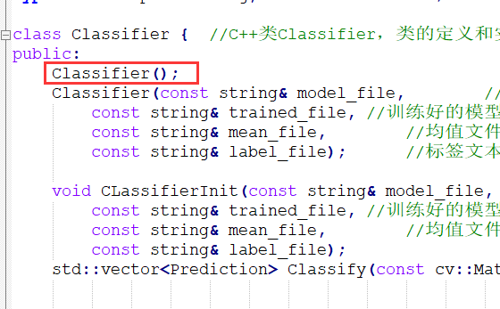
   - 在类中添加初始化成员函数ClassificationInit, 实现源码为原有参构造

   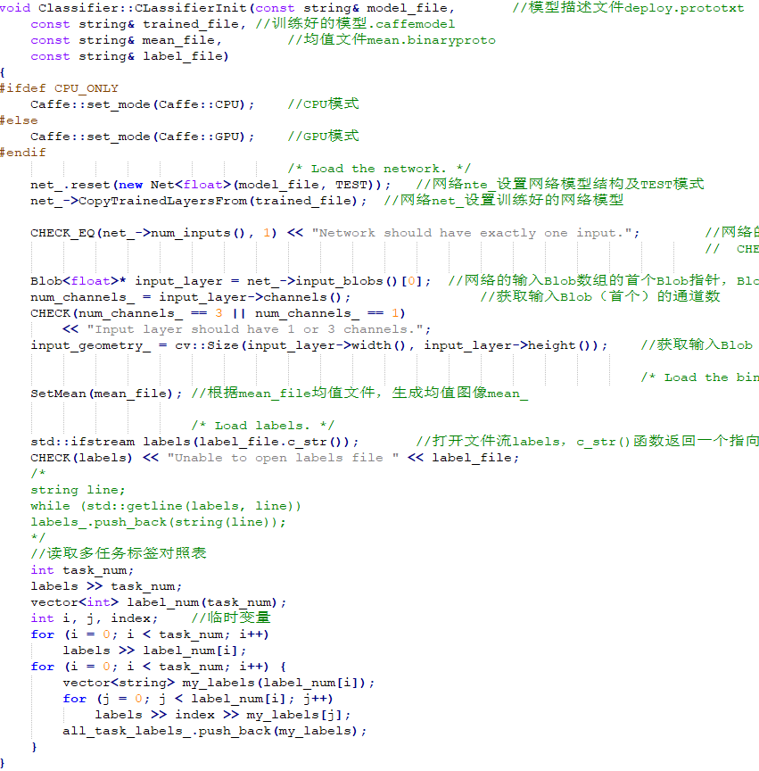
   - 添加DllMain方便测试加载

   - 添加initCode函数, 用来初始化Classfier全局对象(通过def文件导出)

   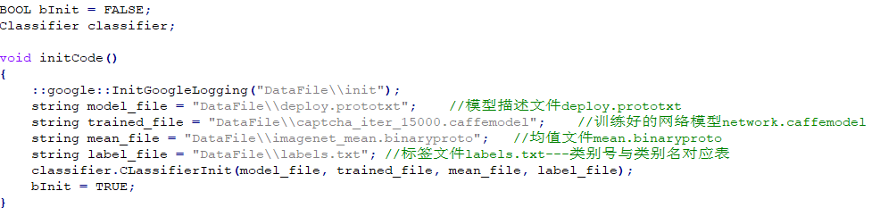
   - 添加getCode函数, 用来获取图片的输出(通过def文件导出)

   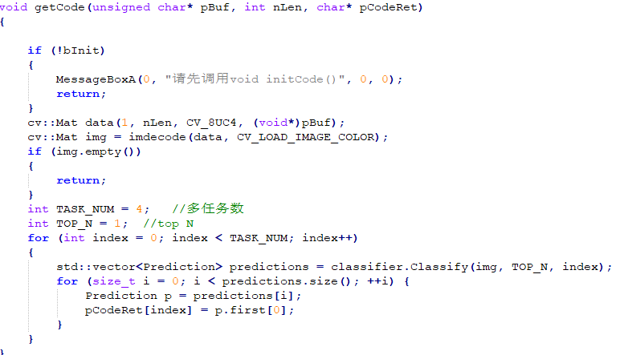
   - 注释掉main函数

   - 将工程修改为dll, 编译生成

    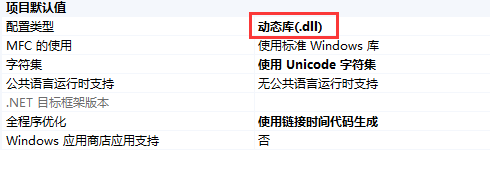

### 至此, dll生成完毕, 可以提供给其他程序愉快地加载调用了~
